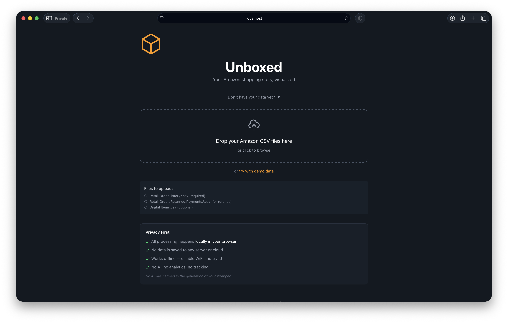
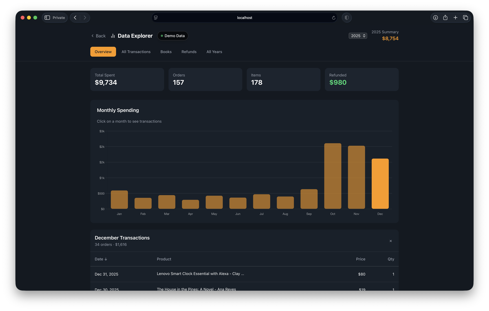
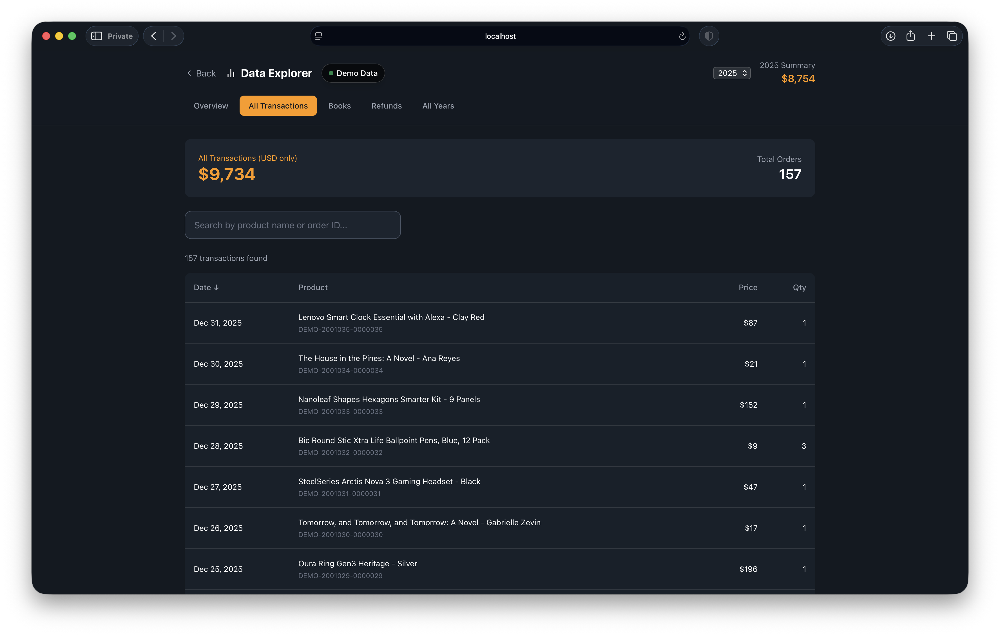
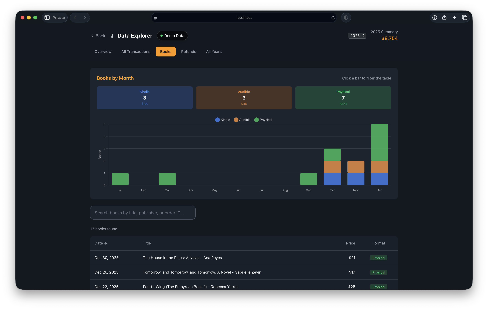
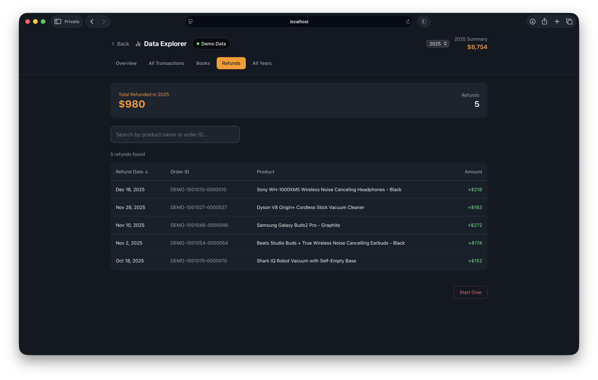
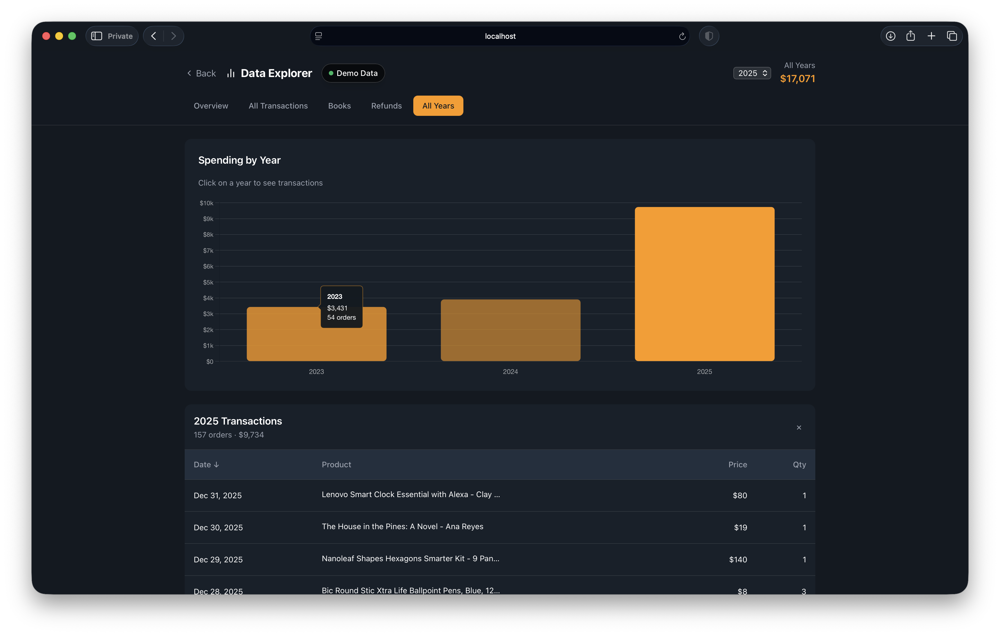

# Unboxed - Your Amazon Year in Review

Unboxed turns your Amazon order history into a simple, Spotify Wrapped–style **recap**:

- 📦 What you bought
- 💸 How much you spent
- 📈 Your busiest (and most expensive) months
- 🔁 Number of orders and returns
- ⏳ Time Machine – jump back to any year in your Amazon history
- 📤 Share – download any slide as an image


There's also an **Explore** view with charts and tables if you want to dig deeper into:

- 📊 All transactions
- ↩️ Returns
- 📚 Books


**Privacy** was really important to me. Everything runs entirely in the browser:

- 🔒 No accounts
- 🚫 No uploads
- 🧠 No servers processing your data
- 👀 No tracking


---

## Get Started

### 1. Try the Demo

Visit **[unboxed.curiousmints.com](https://unboxed.curiousmints.com)** and click "Try Demo" to explore with sample data.

### 2. Use Your Own Data

#### Step 1: Request your data from Amazon

1. Go to [Amazon Privacy Central](https://www.amazon.com/hz/privacy-central/data-requests/preview.html)
2. Click **"Request Your Data"**
3. Select **"Your Orders"** and submit
4. Wait for Amazon's email (usually a few hours, sometimes up to a few days)
5. Download and unzip the file you receive

#### Step 2: Find the files you need

Look inside the unzipped folder for these three types of data:

| Type | Folders | Files inside | Required? |
|------|---------|--------------|:---------:|
| **Orders** | `Retail.OrderHistory.1/`, `Retail.OrderHistory.2/`, etc. | `Retail.OrderHistory.1.csv`, `Retail.OrderHistory.2.csv`, etc. | **Yes** |
| **Returns** | `Retail.Orders.ManageYourReturns.1/` | `Retail.Orders.ManageYourReturns.1.csv` | Optional |
| **Digital** | `Digital-Ordering.1/` | `Digital Items.csv` | Optional |

> **Tip**: Grab all the CSV files from these folders. The app will figure out what it needs.

#### Step 3: Load your files

**Option A: Use the online version**
1. Open [unboxed.curiousmints.com](https://unboxed.curiousmints.com)
2. Drag and drop your CSV files onto the page (or click to browse)
3. Your recap generates instantly

**Option B: Run locally**
```bash
git clone https://github.com/ajot/amazon-unboxed.git
cd amazon-unboxed
npm install
npm run dev
```
Then open `http://localhost:5173` and drop your files.



> **Note**: You can drop all CSVs at once. The app auto-detects which files it needs and ignores the rest.

---

## Features

### Wrapped Slideshow

Animated slides showing your year in review — total spending, order counts, peak shopping month, top items, biggest purchases, and more.


### Explore Dashboard

Dig into your data with interactive charts and searchable tables.











---

## Development

```bash
npm install       # Install dependencies
npm run dev       # Start development server
npm run build     # Build for production
```

### Tech Stack

- React 18 + TypeScript
- Vite
- Tailwind CSS v4
- Framer Motion (animations)
- Chart.js (charts in Explore mode)
- Papa Parse (CSV parsing)
- html-to-image (slide downloads)

---

## Contributing

Contributions welcome! Please feel free to submit issues and pull requests.

## License

MIT
